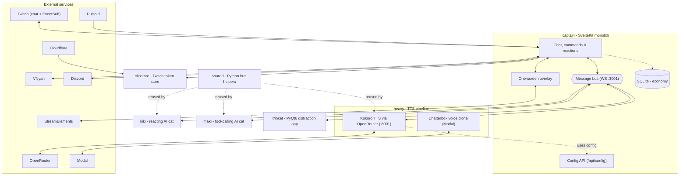

# Streamerzoid

A monorepo containing streaming tools, bots, widgets and overlays for the [this Twitch channel](https://twitch.tv/vanorsigma).
The entire system is intended to be as distracting to the streamer & engaging to the viewer as possible.

It is tailored to work only for the channel and its broadcaster; hence, components are heavily coupled to the broadcaster's system by default. It is not
meant to be used outside of the broadcaster's environment.

It has:
- Commands (lots of them spanning different categories - clipping, gambling, economy, distractions, etc);
- Chat TTS via Kokoro;
- Streamer voice clone via Chatterbox;
- Reaction events (watch streaks, first time chatters, subs, bits);
- Heart rate tracking;
- Economy, which partially utilizes heart rate;
- Chat bullet overlay with customizability via chat commands;
- A _cool_ starting soon screen with fanart showcase;
- An AI cat that can react to chat messages in <3s (Kiki);
- An AI cat that can react to the streamer by voice activation, take screenshot and run (moderation) commands on stream;
- More features I forgot about.

[Stream Guide](https://docs.catmaid.dev)'s origin repository can be found [here](https://github.com/vanorsigma/streamdocs).

This monorepo integrates with:
- StreamElements, for display on the one-screen overlay;
- VNyan;
- Discord;
- OpenRouter;
- Hyprland, with a currently unpublished plugin that allows GLSL shaders to be controlled via a UNIX socket;
- Twitch;
- Pulsoid;
- https://neurokaraoke.com;
- YouTube;
- Modal AI for small LLM hosting;
- Cloudflare.

## Architecture

Very important parts:
- `captain` is the "core" of the monorepo; it serves the config and secrets, and provides a visual interface to the entire system for the broadcaster.
- `captain/shared` contains the "helper" processes of the monorepo; this needs to be launched for captain to communicate with any sub-processes.
It also spawns the environment-specific helpers, such as the Beepbox players and Discord bot.
- `overlay` (a route within `captain`, but is explicitly designed to be standalone from the rest of `captain` and its routes) should be either shown with an overlay program (something that shows it in front of other processes) or from OBS.
- `startingsoon` should be shown in OBS.
- `heavy` serves the two TTS voices.
- `kiki` reacts to chat, `maki` reacts to the streamer by voice, runs (moderation) tools on stream;
- `clipstore` is a Cloudflare Worker acting as the Twitch token store for the `%clip` command;
- `trinket` is a desktop PyQt6 app for in-studio distractions (emotes & co, driven by chat commands).

The following flowchart hopefully shows the architecture better:

## Past

This monorepo _used_ to integrate with:
- `obs-studio`;
- A custom build of [picom](https://github.com/vanorsigma/picom), built to load a folder of GLSL shaders and a unix socket for stream widget purposes;
- `snekstudio` with the custom [WebSocket mod](https://github.com/vanorsigma/snekstudio-ws-mod) to toggle outfits;

## Contributing

Sure! Just submit a PR. I reserve the right to set the direction of both the features I want to introduce, and how to structure the code though.
It's also okay to use AI agents, but:
- Check your work;
- I heavily rely on DRY and YAGNI;
- Code should be so simple that no comments are needed;
- You **cannot** use this repository to train your AI models.

## License

No permissions by default. Contact me on Discord (@vanorsigma) for an exception.
